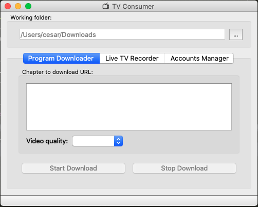

# TV Capture
Programa para capturar la señal online de los más conocidos canales de televisión chilena.
Este programa permite:
- Grabar señal en vivo
- Programar el grabado de señal en vivo
- Descargar programas pasados
- Detectar automáticamente las resoluciones disponibles
- Gestionar cuentas en los canales

## Compilar en Windows (.exe)

1. Run virtual environment: `run windows_exe.bat`
2. Test app: `fbs run`
3. Create self contain folder: `fbs freeze`
4. Create installer: `fbs installer`
5. Finish virtual env: `deactivate`

## Bibliografía

Conceptos generales para trabajar la GUI con PyQt5: 
- https://build-system.fman.io/pyqt5-tutorial
- https://www.tutorialspoint.com/pyqt/

Uso de FBS:
- https://www.learnpyqt.com/courses/packaging-and-distribution/packaging-pyqt5-apps-fbs/
- https://github.com/mherrmann/fbs-tutorial

Para instalar ujson y librerías necesarias para crear instalador en Windows:
- https://www.scivision.co/python-windows-visual-c-14-required/
- https://nsis.sourceforge.io/Main_Page (instalar NSIS)
- https://helpdeskgeek.com/windows-10/add-windows-path-environment-variable/ (agregar variables de ambiente)

